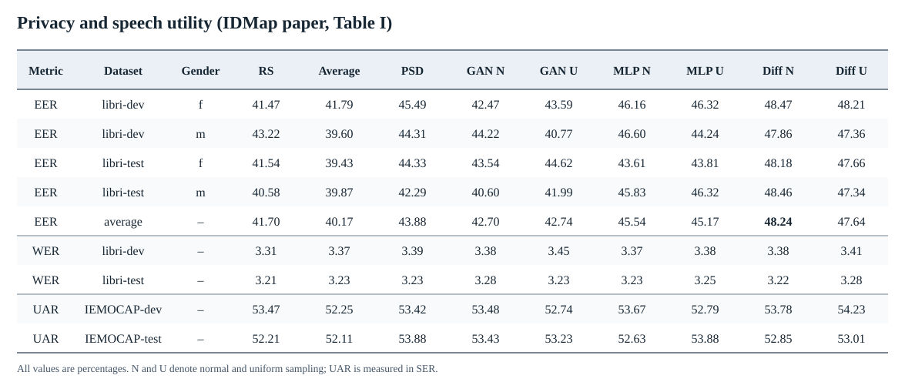
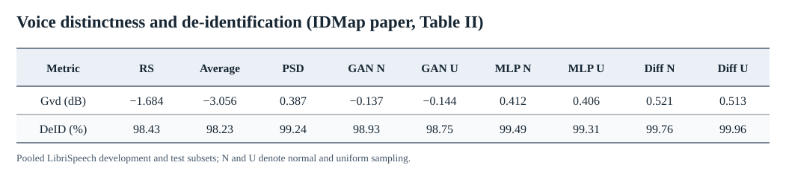
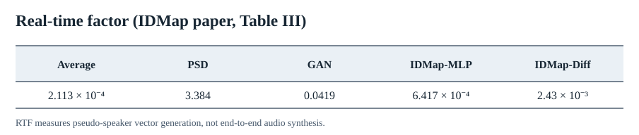

# IDMap: A Pseudo-Speaker Generator Framework Based on Speaker Identity Index to Vector Mapping

## Audio Samples

Listen to the [IDMap audio samples](https://voiceprivacy.github.io/IDMap/) (original speech and anonymized outputs). The corresponding sample files and demo page are in [`Original/`](Original/).

## Introduction

Voice anonymization aims to conceal a speaker's identity while retaining the information needed to understand the speech. In a speech-generation pipeline, this can be done by replacing the source speaker representation with one representing a pseudo-speaker. Choosing that representation matters: two pseudo-speakers should remain distinguishable, and generating many identities should not become prohibitively expensive.

The [IDMap paper](https://arxiv.org/abs/2511.06246) addresses pseudo-speaker uniqueness and generation efficiency by mapping an identity index to a speaker vector. An index is assigned without reuse when a new pseudo-speaker is required. The paper studies both IDMap-MLP and IDMap-Diff and evaluates privacy, speech utility, voice distinctness, and computational cost, including large-scale settings.

IDMap can be trained in the speaker-conditioning space of a chosen synthesis backend. Here we provide IDMap-MLP weights and batched synthesis pipelines for **Qwen3-TTS** and **CosyVoice3**, with links to the generators' official weights. The original paper implementation and SA-toolkit are in [`Original/`](Original/). IDMap-Diffusion extension code is **under review**; the reproduction steps below use IDMap-MLP.

## Main Results from the IDMap Paper

The tables below are recreated as scalable SVG text from the paper's published values. The original raster excerpts remain in [`figures/`](figures/) for comparison.

### EER, WER, and UAR



### Gain of voice distinctness (Gvd)



### Real-time factor (RTF)



## Reproduce with Qwen3-TTS or CosyVoice3

## Step 1 — Set up the environment

Use a separate environment for each generator because their upstream dependencies differ. Python 3.11 and a CUDA-compatible PyTorch/torchaudio installation are recommended. Install PyTorch for your CUDA runtime first.

```bash
git clone https://github.com/VoicePrivacy/IDMap.git
cd IDMap
python -m venv .venv
source .venv/bin/activate
python -m pip install --upgrade pip
python -m pip install -e '.[audio,test]'
python -m pytest -q tests
```

For Qwen3-TTS, install the [official Qwen3-TTS runtime](https://github.com/QwenLM/Qwen3-TTS) (`python -m pip install qwen-tts`). For CosyVoice3, follow the [official CosyVoice installation](https://github.com/FunAudioLLM/CosyVoice), including Matcha-TTS and S3Tokenizer. Its batch worker needs the vendor `hf_merged/` conversion and a `PYTHONPATH` containing the CosyVoice packages. See the [backend setup guide](docs/native_training_and_synthesis.md) for the conversion command and environment details. A passing unit test checks code structure, not generated audio quality.

## Step 2 — Download the models

Download the **generator** weights from their publishers and the **matching IDMap-MLP** weights from this repository's release. The 1024-D Qwen3-TTS speaker space and 192-D CosyVoice3 speaker space are not interchangeable.

| Generator model | IDMap-MLP weight | Speaker space |
| --- | --- | --- |
| [Qwen3-TTS-12Hz-0.6B-Base](https://huggingface.co/Qwen/Qwen3-TTS-12Hz-0.6B-Base) | [Download Qwen3-TTS IDMap-MLP](https://github.com/VoicePrivacy/IDMap/releases/download/v0.1.0-native-idmap/qwen3tts_librispeech360_1024d_idmap_mlp_inference.pt) | Native 1024-D x-vector |
| [Fun-CosyVoice3-0.5B-2512](https://huggingface.co/FunAudioLLM/Fun-CosyVoice3-0.5B-2512) | [Download CosyVoice3 IDMap-MLP](https://github.com/VoicePrivacy/IDMap/releases/download/v0.1.0-native-idmap/cosyvoice3_campplus_192d_idmap_mlp_inference.pt) | Native 192-D CAM++ |

```bash
mkdir -p checkpoints/downloaded
curl -fL -o checkpoints/downloaded/qwen-idmap-mlp.pt \
  https://github.com/VoicePrivacy/IDMap/releases/download/v0.1.0-native-idmap/qwen3tts_librispeech360_1024d_idmap_mlp_inference.pt
curl -fL -o checkpoints/downloaded/cosy-idmap-mlp.pt \
  https://github.com/VoicePrivacy/IDMap/releases/download/v0.1.0-native-idmap/cosyvoice3_campplus_192d_idmap_mlp_inference.pt
sha256sum checkpoints/downloaded/*.pt  # macOS: shasum -a 256
```

Compare the hashes with the [published checksums](checkpoints/README.md). Only load trusted PyTorch checkpoints. The linked IDMap files are inference weights, not copies of the vendor generator models.

## Step 3 — Anonymize audio

The synthesis workers consume a JSONL manifest with one utterance per line:

```json
{"utterance_id":"session1-turn1","text":"Hello there.","anonymous_index":12345,"output_relative_path":"session1/turn1.wav"}
{"utterance_id":"session1-turn2","text":"I agree.","anonymous_index":12345,"output_relative_path":"session1/turn2.wav"}
```

Reusing an index preserves a pseudo-speaker across turns; different source speakers must receive different indices. IDMap does not perform diarization or ASR: provide the text and source-speaker assignments from your own pipeline. To create a collision-free manifest from externally assigned session-local speaker IDs, use:

```bash
python scripts/prepare_idmap_manifest.py \
  --input-jsonl /path/to/text_and_tracker_output.jsonl \
  --output manifest.jsonl --mode session --seed 20260924
```

The input JSONL needs `utterance_id`, `text`, `session_id`, and `local_speaker_id`. For independently randomized utterances, choose `--mode utterance` instead. The launcher runs one worker per selected GPU and writes an output-count/failure audit.

**Qwen3-TTS:**

```bash
python scripts/launch_idmap_generation.py --backend qwen --gpus 0,1 \
  --manifest manifest.jsonl --output-dir /path/to/qwen-audio \
  --model-dir /path/to/Qwen3-TTS-12Hz-0.6B-Base \
  --idmap-checkpoint checkpoints/downloaded/qwen-idmap-mlp.pt \
  --expected-speaker-space-prefix qwen3tts-12hz-0p6b-base-xvector-v1 \
  --batch-size 16
```

**CosyVoice3:** convert the official vendor checkpoint to `hf_merged/` as described in the [backend setup guide](docs/native_training_and_synthesis.md), then run:

```bash
python scripts/launch_idmap_generation.py --backend cosy --gpus 2,3 \
  --manifest manifest.jsonl --output-dir /path/to/cosy-audio \
  --model-dir /path/to/Fun-CosyVoice3-0.5B-2512 \
  --hf-model-dir /path/to/Fun-CosyVoice3-0.5B-2512/hf_merged \
  --idmap-checkpoint checkpoints/downloaded/cosy-idmap-mlp.pt \
  --batch-size 8
```

Choose GPUs that are actually free. Inspect the launcher's audit and listen to generated WAVs before reporting evaluation results. For embedding extraction, IDMap training, checkpoint export, and backend-specific batch details, see the [training and synthesis guide](docs/native_training_and_synthesis.md).

Scalable result tables: [EER/WER/UAR](figures/EER_WER_UAR.svg), [Gvd](figures/Gvd.svg), [RTF](figures/RTFs.svg). Original paper excerpts: [EER/WER/UAR](figures/EER_WER_UAR.png), [Gvd](figures/Gvd.png), [RTF](figures/RTFs.png).
